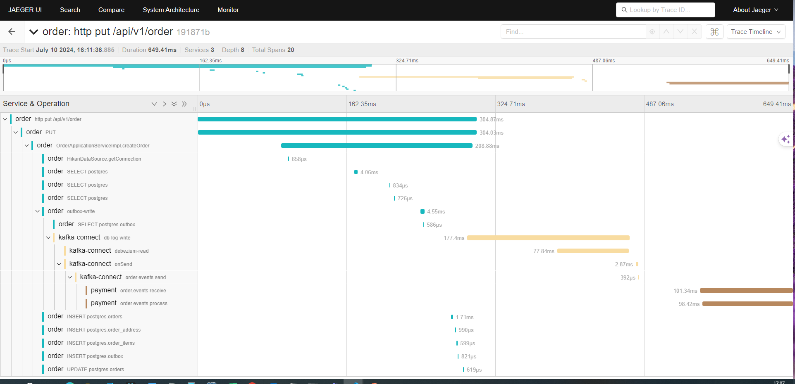

# Outbox

This example demonstrates outbox pattern using Spring, Postgres and Kafka. Outbox pattern is most reliable way to solve the dual write problem where we need to write data to more than one system in an atomic fashion, in our case Postgres and Kafka.

The core problem in dual write is that it is not possible to wrap database write and Kafka message publishing in one transaction. Even if we try to combine in one transaction, it may lead to unwanted failures. To solve this problem, outbox pattern has been introduced. 

## Architecture

Overview of the solution can be seen below.


It has been kept simple by having only two services, namely order and payment. Once the order is created, it needs to be sent to payment services for processing the payment. Order service in addition to writing data to its own table, make entry in one additional table "outbox". 

Changes to the table are read by debezium connector using CDC (Change Data Capture) and published as events to Kafka, which will be processed by payment service.

## Demo
### Build images

This project uses jib maven plugin to build images. Both order and payment spring projects should be built using the following commands. It builds the image and add the image to docker daemon.

```console
$ cd order
$ mvn compile jib:dockerBuild
$ cd ../payment
$ mvn compile jib:dockerBuild
```


### Start the containers

```console
$ cd ../infrastructure
$ docker compose up --build
```

### Configure Debezium connector

```console
$ http PUT http://localhost:8083/connectors/outbox-source-connector/config < connector/outbox-source-connector.json
```

### Create order through REST API

```console
$ http PUT http://localhost:9080/api/v1/order < data/create-order-command.json
```


### Check the output

When we open the following URL of [Kafka UI](http://localhost:9000/ui/clusters/local/all-topics/order.events/messages?keySerde=String&valueSerde=String&limit=100), one can see that events are published in order.events topic. 


## Distributed tracing

Obervability is very important factor in the software system landscape, especially in microservices envrionment. Tracing is one of the three pillars of observability. Tracing is helpful in understanding execution of software system. It will be more useful, when we will be able to trace the application flow across microservices. To see the distributed tracing, please access [jaeger](http://localhost:16686/) and search for traces for the service order and the operation "http put /api/v1/order".


When you select the trace, it will show that order creation has gone through order, kafka-connect and payment. 

